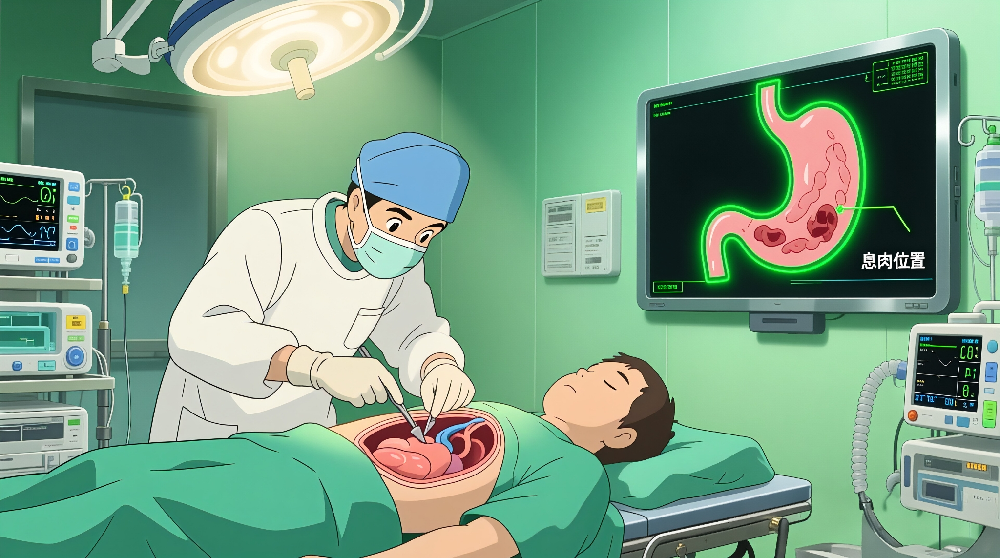
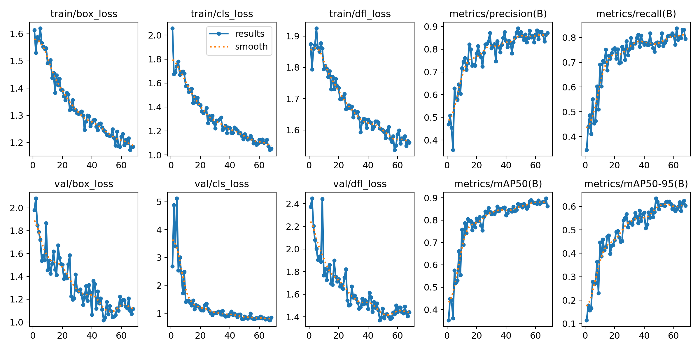
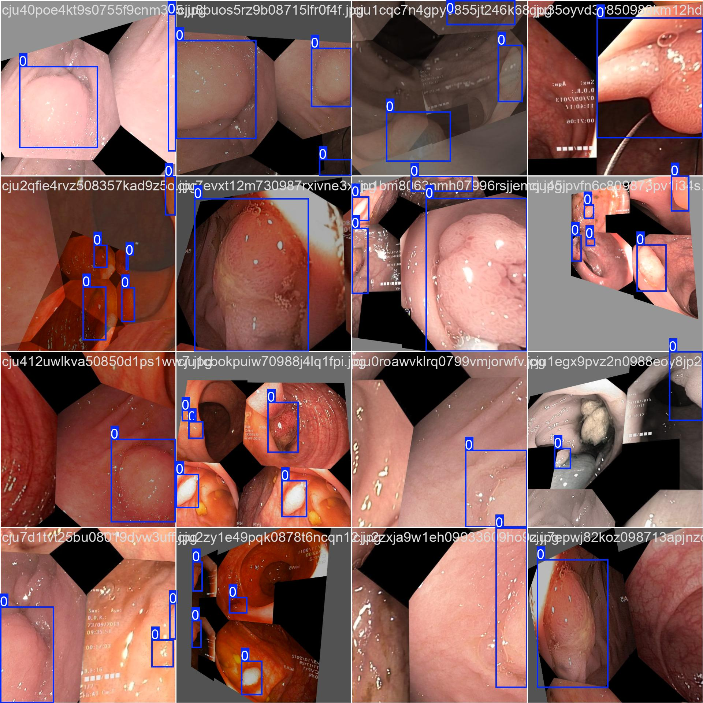
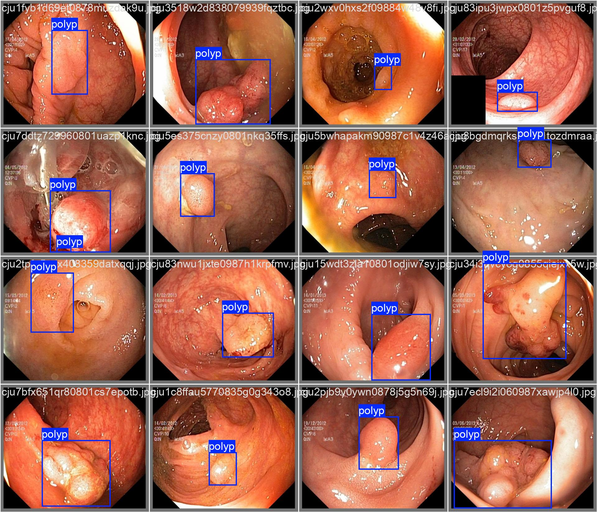
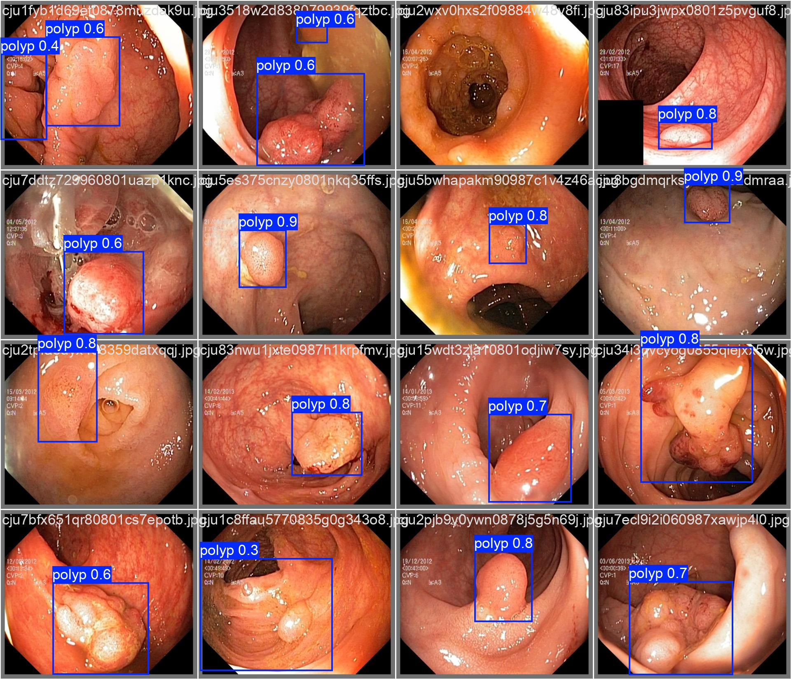
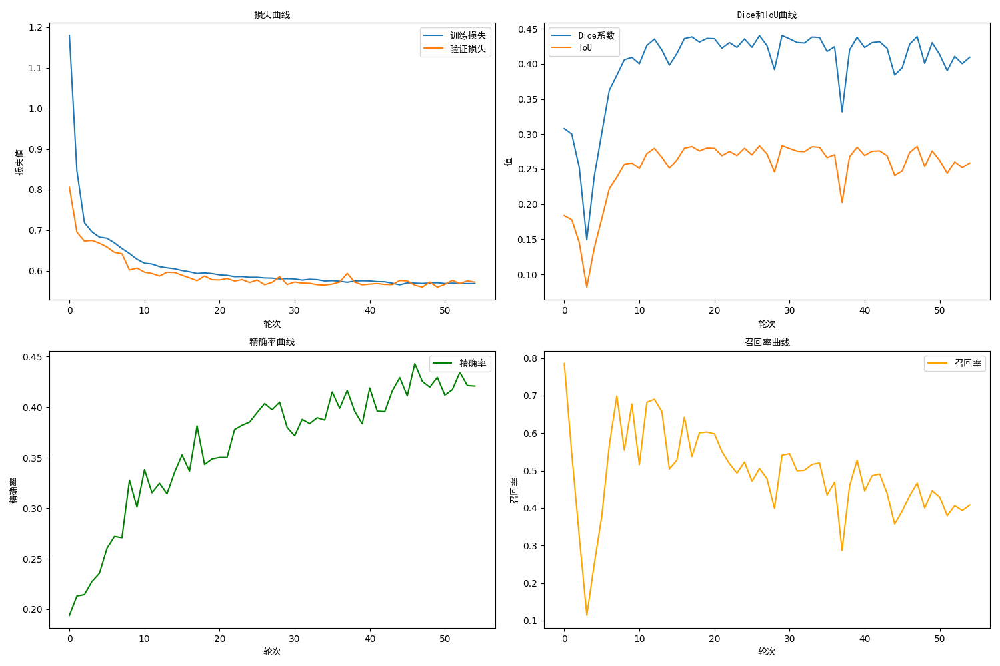
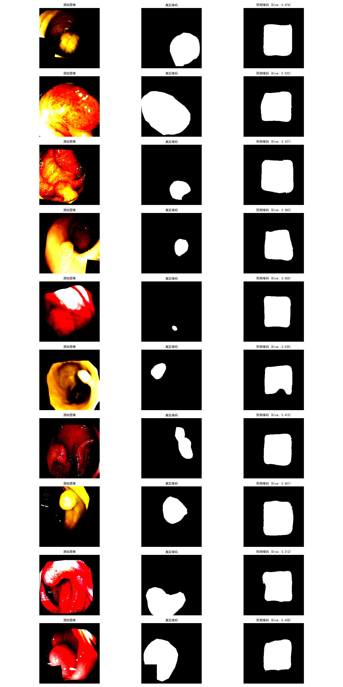

# 胃息肉检测与分割系统



[](https://www.kaggle.com/datasets/debeshjha1/kvasirseg)
[](https://www.ultralytics.com/)

[](https://unetstack.net/)

[](https://www.mit.edu/)

---

## 📋目录

- 🌟[1.项目介绍](#1-项目介绍)

- 📊[2.数据集说明](#2-数据集说明)

- 📁[3.文件夹结构](#3-文件夹结构)

- 🧠[4.模型架构实现](#4-模型架构实现)

- 🚀[5.快速开始](#5-快速开始)

- 📈[6.结果展示](#6-结果展示)

---

## 1. 项目介绍

### 1.1 项目背景

胃息肉作为消化道常见病变，其早期精准检测与轮廓分割对临床诊断和治疗方案制定至关重要。传统人工诊断依赖医师经验，存在小息肉漏检、边界定位误差等问题。本项目基于深度学习技术，构建 “检测 - 分割” 二阶段智能分析系统，实现胃息肉的自动定位与精细轮廓提取，为内镜诊断提供辅助工具。

### 1.2 核心功能

* **息肉检测**：自动识别图像中胃息肉的位置，输出边界框坐标与置信度；

* **语义分割**：精准提取息肉区域的像素级轮廓，区分病变与正常组织；

* **数据预处理**：内置数据集校验、格式转换（CSV→YOLO）与自动划分功能；

* **可视化展示**：生成检测结果对比图、分割掩码可视化及训练指标曲线；

* **模型优化**：含早停机制、学习率预热、数据增强等策略，提升泛化能力。


## 2. 数据集说明

### 2.1 数据集来源

采用公开医学影像数据集 **Kvasir-SEG**（可通过 Kaggle 获取：[Kvasir-SEG Data (Polyp segmentation & detection) (kaggle.com)](https://www.kaggle.com/datasets/debeshjha1/kvasirseg)），该数据集包含临床内镜下胃息肉图像及对应标注，是息肉分割任务的基准数据集。

### 2.2 数据结构

原始数据集包含两个核心目录，适配检测与分割双任务：

```makefile
Kvasir-SEG/
├── images/          # 原始内镜图像（支持jpg格式）
├── bbox/            # 检测任务标注（CSV格式，含类别、边界框坐标）
└── masks/           # 分割任务标注（灰度图像，息肉区域为白色）
```

### 2.3 数据处理细节

* **检测任务**：

1. 校验图像有效性（排除空图、损坏文件）；

2. 将 CSV 标注（class\_name, xmin, ymin, xmax, ymax）转换为 YOLO 格式（归一化中心坐标 + 宽高）；

3. 按 8:2 比例随机划分训练集 / 验证集，生成 data.yaml 配置文件。

* **分割任务**：

1. 图像与掩码尺寸统一 resize 至 256×256；

2. 按 85:15 比例划分训练集 / 验证集，小样本时自动重复数据增强训练；

3. 内置多维度数据增强（翻转、旋转、缩放、弹性变换等）。


## 3. 文件夹结构

```makefile
Kvasir-SEG/
├── data/                      # 数据目录
    ├── Kvasir-SEG/            # 原始数据集（需自行下载放置）
        ├── images/
        ├── bbox/
        └── masks/
    └── dataset/               # 检测任务处理后数据（代码自动生成）
        ├── images/
            ├── train/
            └── val/
        ├── labels/
            ├── train/
            └── val/
        └── data.yaml
├── train_pre.py     # 息肉检测代码（YOLOv8）
├── train_mask.py    # 息肉分割代码（AttUNet）
├── log/
├── output/                   # 输出结果目录（代码自动生成）
    ├── polyp_detection/       # 检测模型输出
        └── exp/
            └── weights/       # 最佳检测模型权重（best.pt）
    ├── model/
    └── pic/
├── requirements.txt
└── README.md
```


## 4. 模型架构实现

### 4.1 息肉检测模型（YOLOv8n）

基于 Ultralytics YOLOv8 nano 版本，轻量化且高效，架构包含三部分：

* **Backbone（特征提取）**：CSPDarknet 结构，通过 5 次下采样提取多尺度特征，采用残差连接缓解梯度消失；

* **Neck（特征融合）**：PANet（路径聚合网络），融合浅层空间信息与深层语义信息，增强小目标检测能力；

* **Head（检测头）**：Anchor-free 设计，直接预测目标中心坐标、宽高及置信度，输出 1 类（polyp）检测结果。

代码关键实现：

* 加载预训练模型`YOLO('``yolov8n.pt``')`，冻结部分参数微调；

* 训练参数：150 轮、640×640 输入尺寸、批量 16、早停耐心 15 轮；

* 数据增强：马赛克（mosaic）、水平翻转、平移缩放等。

### 4.2 息肉分割模型（轻量化 AttUNet）

在传统 U-Net 基础上加入注意力机制，优化特征融合，架构细节：

1. **核心组件**：

* **DoubleConv**：两次 3×3 卷积 + 批归一化 + ReLU，含 dropout（0.25）抑制过拟合；

* **Down**：最大池化（2×2）+ DoubleConv，实现下采样与特征深化；

* **Up**：双线性插值上采样 + 注意力门 + 特征拼接 + DoubleConv，注意力门权重来自解码器特征；

* **AttentionGate**：通过门控信号筛选编码器有效特征，增强息肉区域响应。

1. **轻量化设计**：

* 起始通道数 32（传统 U-Net 为 64），依次为 32→64→128→256→512；

* 采用双线性插值替代转置卷积，减少参数计算量。

1. **损失与优化**：

* 混合损失函数：0.3× 交叉熵损失 + 0.7×Dice 损失，平衡类别不平衡与边界精度；

* 优化器：AdamW（学习率 1e-4，权重衰减 1e-5）；

* 学习率策略：前 3 轮预热，后续按验证损失衰减（因子 0.5）。


## 5. 快速开始

### 5.1 环境配置

推荐使用 Python 3.11+，通过 pip 安装依赖：

```bash
pip install -r requirements.txt
```

* GPU 要求：显存≥4GB（推荐 NVIDIA RTX 3090/4090）；

* 若无 GPU，需修改代码中`device=0`为`device='cpu'`。

### 5.2 数据准备

1. 下载 Kvasir-SEG 数据集，解压至`data/Kvasir-SEG/`目录；

2. 检测代码：无需手动处理标注，运行时自动转换 CSV 至 YOLO 格式；

3. 分割代码：确保`images/`与`masks/`文件同名匹配（如 img1.jpg 对应 img1.png）。

### 5.3 模型训练与预测

#### 5.3.1 息肉检测

1. 修改`polyp_detection.py`中路径配置：

```python
BASE_DATA_PATH = "data/Kvasir-SEG/Kvasir-SEG"  # 原始数据路径
WORKING_DIR = "results"                        # 输出目录
```

2. 运行训练：

```bash
python train_pre.py
```

3. 输出结果：

* 模型权重：`results/polyp_detection/exp/weights/``best.pt`；

* 可视化图：自动弹出 5 组真实 vs 预测边界框对比；

* 评估指标：终端打印 mAP50、mAP50-95、精确率、召回率。

#### 5.3.2 息肉分割

1. 修改`polyp_segmentation.py`中路径配置：

```python
image_dir = "data/Kvasir-SEG/Kvasir-SEG/images"
mask_dir = "data/Kvasir-SEG/Kvasir-SEG/masks"
```

2. 运行训练：

```bash
python train_mask.py
```

3. 输出结果：

* 模型权重：`results/best_model.pth`；

* 可视化图：`predictions.png`（10 组原始 - 真实掩码 - 预测掩码对比）；

* 指标曲线：`metrics_curve.png`（损失、Dice、精确率、召回率变化）。


## 6. 结果展示

### 6.1 检测任务结果

#### 6.1.1 量化指标

|    指标     |  数值  |          说明           |
| :---------: | :----: | :---------------------: |
|    mAP50    | 0.8735 |  IoU=0.5 时的平均精度   |
|  mAP50-95   | 0.6332 | IoU=0.5-0.95 的平均精度 |
| 精确率（P） | 0.9065 | 预测为息肉的样本准确率  |
| 召回率（R） | 0.7706 |    真实息肉的检出率     |
| F1分数（F） | 0.8330 |    息肉的F1分数结果     |

#### 6.1.2 可视化效果

- 训练指标记录：



- 训练输出：



- 验证集标签输出（建议与下面的真实预测进行对比查看）：



- 验证集预测输出：



位置检测任务总体上准确率相对较高，能够有效检测大致位置，但是碍于样本总数较少，训练效果并为达到最优，小周这里的数据已经经过了数据增强处理，您也可以在此基础上进一步修改，以提高准确率和检测置信度。

### 6.2 分割任务结果

#### 6.2.1 量化指标

| 指标          | 数值   | 说明                       |
| ------------- | ------ | -------------------------- |
| Dice 系数     | 0.4405 | 预测与真实掩码的重叠度     |
| IoU（交并比） | 0.2837 | 预测区域与真实区域交集占比 |
| 精确率        | 0.3800 | 预测息肉区域的准确率       |
| 召回率        | 0.5414 | 真实息肉区域的覆盖度       |

#### 6.2.2 可视化效果

1. **训练曲线**（metrics\_curve.png）：

* 4 个子图：训练 / 验证损失曲线、Dice-IoU 变化曲线、精确率曲线、召回率曲线；

* 收敛特征：通常 50-80 轮达到收敛，早停机制避免过拟合。



2. **预测对比图**（predictions.png）：

* 3 列布局：原始内镜图像、真实灰度掩码（白色为息肉）、预测掩码（含单样本 Dice 值）；

* 后处理优化：自动过滤面积 < 50 像素的噪点区域，提升掩码纯净度。



因为样本较少（仅为1000个样本），小周也尝试了模糊，变形等多重的数据增强方式，但是效果都不太理想，使用较大的模型时，已发生过拟合以及陷入局部最优，上图的预测就可以很好的展示（模型倾向于将大范围的面积认作是结果，以此达到一个 0.5 Dice系数的局部最优解）。如果您有更好的思路，欢迎进行交流补充，这里小周就是抛砖引玉了。
